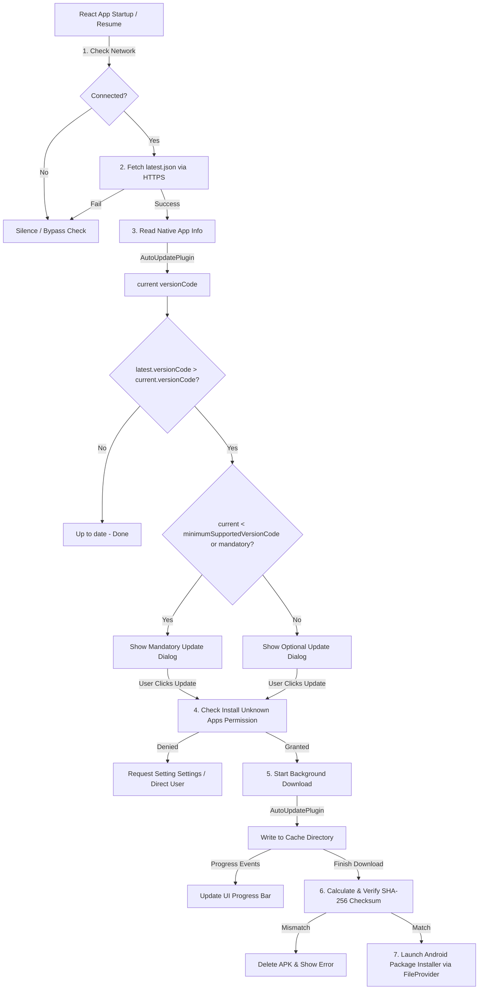

# Android Self-Hosted Auto-Update System

This document outlines the architecture, update flow, version management, and publishing workflow for the self-hosted Android auto-update system.

---

## 1. System Architecture

The auto-update system is fully self-hosted, bypassing the Google Play Store completely. It integrates a custom Capacitor native Android plugin with a global React context checker in Next.js and an automated GitHub Actions build and deployment pipeline.



---

## 2. Update Manifest Format (`latest.json`)

The manifest contains metadata describing the latest published release. It is hosted as a release asset in the repository.

```json
{
  "versionName": "1.0.1",
  "versionCode": 10001,
  "apkUrl": "https://github.com/<owner>/<repo>/releases/download/v1.0.1/app-release-signed.apk",
  "mandatory": false,
  "releaseNotes": [
    "Improved app startup performance",
    "Fixed message status indicator lag",
    "Added animated sticker support"
  ],
  "minimumSupportedVersionCode": 10000,
  "publishedAt": "2026-08-22T00:00:00Z",
  "sha256": "8a5c37f4...6d4e"
}
```

### Fields:
- **`versionName`**: Human-readable string representation of the version (e.g. `1.0.1`).
- **`versionCode`**: An integer indicating the version. Calculated automatically from the `versionName` (`major * 10000 + minor * 100 + patch`).
- **`apkUrl`**: Public HTTPS direct download link for the signed APK release.
- **`mandatory`**: Boolean. If `true`, requires the user to update immediately.
- **`releaseNotes`**: Array of strings outlining changes, bug fixes, or new features.
- **`minimumSupportedVersionCode`**: If the user's `versionCode` is lower than this number, the update is forced regardless of the `mandatory` flag.
- **`publishedAt`**: ISO timestamp indicating when the release was built.
- **`sha256`**: Hexadecimal SHA-256 checksum of the APK file to verify integrity before triggering installation.

---

## 3. Versioning Rules

To ensure reliable update eligibility detection:
1. **Single Source of Truth**: The version is configured in `package.json` under `"version": "x.y.z"`.
2. **Auto-Calculated Version Code**: During native Android builds, the version code is generated dynamically as:
   $$\text{versionCode} = (\text{major} \times 10000) + (\text{minor} \times 100) + \text{patch}$$
   *Example: `"version": "1.4.12"` translates to `10412`.*
3. **Ascending Codes**: Every release MUST increment the version in `package.json` to guarantee a higher `versionCode`.
4. **Prevents Downgrade**: The update checker compares the native integer version codes. Downgrades or re-installing the same `versionCode` are ignored.

---

## 4. GitHub Actions Release Process

The build and deployment pipeline is defined in `.github/workflows/android.yml`.

### Triggers:
1. **Git Tag Push**: Pushing a git tag starting with `v` (e.g. `git tag v1.0.1 && git push origin v1.0.1`).
2. **Manual Dispatch (`workflow_dispatch`)**: Triggered manually from the GitHub Actions tab.

### Automated Actions:
1. Extracts `versionName` and calculates `versionCode` from `package.json`.
2. Compiles Next.js static assets and syncs them to the Capacitor Android project.
3. Compiles the release APK and signs it using Android Keystore secrets.
4. Generates the SHA-256 checksum of the signed APK.
5. Builds the update manifest (`latest.json`) dynamically, embedding the correct redirect URL and checksum.
6. Creates a GitHub Release and uploads both the signed APK and the `latest.json` file as release assets.

---

## 5. How to Create a Release (Step-by-Step)

When you are ready to publish a new version:

1. **Update package.json**:
   Increment the version string in the root `package.json`:
   ```json
   "version": "1.0.1"
   ```
2. **Commit and Push**:
   ```bash
   git add package.json
   git commit -m "chore: bump version to 1.0.1"
   git push origin main
   ```
3. **Publish via Git Tag** (Recommended):
   ```bash
   git tag v1.0.1
   git push origin v1.0.1
   ```
   *Alternatively, navigate to the **Actions** tab in your GitHub repository, select **Build Android App**, and click **Run workflow** manually.*

---

## 6. Security Features

- **HTTPS Mandatory**: The system only checks for updates and downloads APK files over TLS/HTTPS. Plain text HTTP is rejected.
- **SHA-256 Integrity Verification**: Before triggering the package installer, the custom Android plugin hashes the downloaded file and compares it to the value in `latest.json`. If a mismatch is found (due to transfer corruption or interception), the APK is immediately deleted.
- **No Silent Installation**: The system launches Android's official package installer via `Intent.ACTION_VIEW`. The user must review permissions and approve the update.
- **No Hardcoded Secrets**: Secrets (keystores, passwords, backend variables) are kept in GitHub Secrets and never stored in the compiled APK or source code.
- **Secure File Sharing**: The downloaded APK is saved to the private application cache directory (`context.getCacheDir()`) and shared with the Android Package Installer using standard `FileProvider` content URIs. No general external storage write permissions are required.

---

## 7. Android System Permissions & Settings

For Oreo (Android 8.0 / API 26) and above, installing APKs outside of the Google Play Store is governed by the "Install unknown apps" permission.
- The app requests `<uses-permission android:name="android.permission.REQUEST_INSTALL_PACKAGES" />`.
- When the user taps **Update Now**, if permission is not yet granted, the app shows a clean user guidance dialog and redirects the user directly to the toggle setting:
  ```java
  Intent intent = new Intent(Settings.ACTION_MANAGE_UNKNOWN_APP_SOURCES);
  intent.setData(Uri.parse("package:" + context.getPackageName()));
  ```
- When the user toggles the switch and returns to the app, the download starts automatically.

---

## 8. Offline & Fail-Safe Behavior

- **No UI Block**: The update check occurs asynchronously in the background. It does not block calendar loading or navigation.
- **Silent Failures**: If the update server is unreachable or return metadata is malformed, the app catches the error silently and allows the user to continue using the current version.
- **Network Awareness**: Uses the `@capacitor/network` plugin to skip checks entirely if Wi-Fi or cellular networks are disconnected.

---

## 9. Rollback Procedure

If a bug is discovered in a published release:
1. **Immediate Metadata Update**: Edit the `latest.json` on the latest GitHub Release or your custom static endpoint.
2. **Point APK to Stable**: Change the `apkUrl` and `sha256` fields in `latest.json` to point back to the previous stable release APK.
3. **Increment Version Code**: Set the `versionCode` in the modified `latest.json` to a value higher than the buggy release.
4. **Result**: All users who installed the buggy update will detect a "new update available" and be redirected to install the stable version.
5. **Normal Bump**: Once the bug is fixed, publish the next code release bump with an even higher version code (e.g. `1.0.2` or `10002`).
