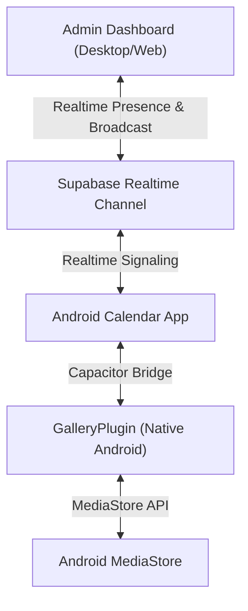

# Remote Gallery System Architecture

This document describes the existing architecture of the Calendar application and outlines the design and integration of the new **Remote Gallery** system.

---

## 1. Existing Relevant Architecture

The Calendar application is built as a hybrid web/native system:
* **Frontend**: Next.js 16 (React 19) utilizing Tailwind CSS v4, compiled as a Single Page Application (SPA) using static export (`output: 'export'`) for native mobile wraps, and deployed as a dynamic server on Vercel for the web client.
* **Native Wrap**: Apache Capacitor 8.5 registers native plugins and loads the compiled Next.js SPA on Android.
* **Database & Auth**: Supabase provides user identity management, auth, PostgreSQL database, storage buckets, and Realtime communication via WebSockets.
* **Push Notifications**: Firebase Cloud Messaging (FCM) is connected via Capacitor Push Notifications, triggered by database webhooks.
* **Stealth local alerts**: Webhooks trigger push notifications natively, and desktop clients use Realtime subscriptions to show decoy reminders.

---

## 2. Existing Authentication Flow

1. The client logs in with email and password via `signInWithPassword` in `@supabase/supabase-js`.
2. A trigger `on_auth_user_created` creates a corresponding profile record in `public.profiles` upon signup.
3. Client-side authentication state is managed by `AuthProvider` (`src/context/AuthContext.tsx`), caching user credentials in `localStorage` and refreshing them on initialization.
4. Periodically (every 1 minute), the web client updates the user's `last_seen` timestamp in the `profiles` table.

---

## 3. Existing Chat / Photo Flow

1. Inside `ChatArea.tsx` (`src/components/chat/ChatArea.tsx`), sending a photo triggers a bottom sheet displaying "Camera" and "Gallery" options.
2. Clicking "Gallery" calls `handleNativeGalleryPick()`, which invokes `Camera.pickImages(...)` from `@capacitor/camera`.
3. Selected images are fetched from their native paths (`photo.webPath`), converted to Blobs, and uploaded to the private Supabase storage bucket `chat_images`.
4. RLS policies on `storage.objects` verify that the uploader is a member of the conversation where the image is sent.

---

## 4. Existing Android Native Architecture

* **MainActivity.java**: Extends `BridgeActivity` and registers custom plugins like `AutoUpdatePlugin`. It includes safety logic to strip custom notification payloads to prevent deep-linking to private chat destinations.
* **AutoUpdatePlugin.java**: A native Capacitor plugin called `AutoUpdate` that handles OTA update checks, downloads, package installs, and status bar/navigation bar color changes.
* **Gradle Build**: Located in `android/app/build.gradle`. It handles namespace (`com.calendarapp.secure`), min/target SDK versions, and signing configurations.

---

## 5. Existing Supabase Structure

* **Tables**:
  * `profiles`: User profiles with username, display name, avatar, and active status.
  * `conversations`: Private chats.
  * `conversation_members`: Junction table enforcing a maximum of 2 members per chat.
  * `messages`: Message logs for text, images, and games.
  * `message_reactions`: Message reactions.
  * `calendar_events`: User calendar events.
  * `privacy_settings`: Locks private chats.
  * `games` / `game_private_states`: Turn-based private games.
* **Storage**:
  * `chat_images`: Private bucket for chat photos, protected by conversation member verification.
  * `avatars`: Public bucket for user avatars.

---

## 6. Existing OTA Update Architecture

1. APK builds are compiled, signed, and published as GitHub releases containing a `latest.json` file.
2. The endpoint `/api/update` (and its legacy route `/latest.json`) fetches the release metadata from GitHub.
3. The custom `AutoUpdatePlugin` compares the client's `versionCode` against the latest release.
4. If a newer build is available, it downloads the APK, verifies its SHA-256 hash, and invokes the Android package installer.

---

## 7. Integration Plan for Remote Gallery

The Remote Gallery feature will be integrated cleanly across all layers of the application without breaking any existing features:

### A. Database Additions
* **`public.profiles`**: Add `is_admin` boolean flag to designate administrative accounts.
* **`public.devices`**: Track device models, platform versions, and online/pairing states.
* **`public.pairing_codes`**: Manage short-lived, single-use activation keys.
* **`public.media_metadata`**: Index remote media information without storing binary files in Postgres.
* **`public.audit_logs`**: Record all dashboard operations for security audits.

### B. Native Custom Android Plugin (`GalleryPlugin`)
* Create `GalleryPlugin.java` under `com.calendarapp.secure`.
* Implement methods to:
  * Check and request Android photo/media permission (`READ_MEDIA_IMAGES` or `READ_EXTERNAL_STORAGE`).
  * Query the `MediaStore` to compile media metadata (filenames, dimensions, timestamps, etc.).
  * Retrieve specific media items by their `MediaStore` ID, converting them to compressed byte streams or temporary files.
  * Register a `ContentObserver` to monitor real-time changes to the `MediaStore` (New Photo Detection).

### C. Web & Realtime Signaling
* Create an Admin Dashboard under `/src/app/admin`.
* Establish a secure Supabase Realtime channel (`remote-gallery:${deviceId}`) for signaling commands (`OPEN_GALLERY`, `LIST_MEDIA`, `GET_THUMBNAIL`, etc.) and returning responses.
* When requesting a full photo or thumbnail, retrieve the file as a Base64 string (or transient signed URL) over a secure, authenticated channel to avoid public exposures.

---

## 8. Potential Conflicts & Risks

* **Android Background Restrictions**: The operating system may sleep or kill the app process if it is in the background. The Admin Dashboard must handle `Offline` status gracefully, and the app must establish connection heartbeats only when actively running (foreground/active).
* **Next.js Static Export (`npm run mobile:build`)**: The Admin Dashboard code under `src/app/admin` must not use any SSR APIs (like `cookies()` or `headers()` during build time) to avoid breaking static HTML compilation for the mobile app. All admin routing must be client-side rendered (`'use client'`).
* **Supabase Realtime Payload Limits**: Large full-resolution images should not be sent directly via Realtime payloads as WebSockets can choke on large binaries. Instead:
  1. Gallery thumbnails and full images will be uploaded temporarily to a private Supabase storage bucket (`gallery_temp`) with short-lived, single-use, auto-expiring links, OR sent chunk-by-chunk/on-demand.
  2. A dedicated private Supabase storage bucket `gallery_temp` will be configured with a strict lifecycle rule (e.g. delete after 1 day) and an RLS policy limiting access strictly to authenticated admin users.
* **Security & Permissiveness**: If a user is not an admin, they must be rejected immediately from accessing the admin dashboard at the database, server API, and client UI layers.
