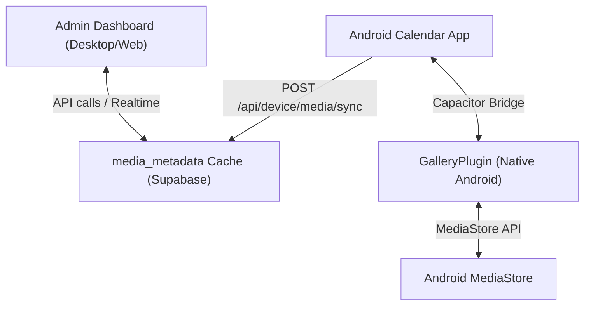

# Remote Gallery System Architecture

This document describes the architecture of the Calendar application's **Remote Gallery** system.

---

## 1. Relevant Core Architecture

The Calendar application is built as a hybrid web/native system:
* **Frontend**: Next.js 16 (React 19) utilizing Tailwind CSS v4, compiled as a Single Page Application (SPA) using static export (`output: 'export'`) for native mobile wraps, and deployed as a dynamic server on Vercel for the web client.
* **Native Wrap**: Apache Capacitor 8.5 registers native plugins and loads the compiled Next.js SPA on Android.
* **Database & Auth**: Supabase provides user identity management, auth, PostgreSQL database, storage buckets, and Realtime communication via WebSockets.

---

## 2. Authentication & Authorization Flow

1. The client logs in with email and password via `@supabase/supabase-js`.
2. Upon signup, a database trigger `on_auth_user_created` creates a corresponding profile record in `public.profiles`.
3. Client-side authentication state is managed by `AuthProvider` (`src/context/AuthContext.tsx`), caching user credentials in `localStorage` and refreshing them on initialization.
4. Administrative access is restricted to profiles with `is_admin = true`. Server-side check `isAdminServer` validates the logged-in user for all admin API endpoints. Next.js middleware guards the `/admin` path.

---

## 3. Remote Gallery Flow

Unlike surveillance apps, this system respects Android security boundaries, explicitly requesting permission and associating registered devices directly with the authenticated account.

### A. Device Registration
* When an authenticated user opens the mobile app, a persistent unique `device_id` is retrieved/created from `@capacitor/preferences`.
* The client sends a `POST /api/device/register` request containing hardware specifications, platform, OS, and app compile version.
* The server upserts the device record inside the `devices` table.

### B. Gallery Permission
* When the user clicks the existing **Chat → Photo** button and selects **Gallery**, the app checks for photo permissions via the native `Gallery` plugin.
* If permission is not granted, a native Android permission dialog is presented. If the user grants permission, the app opens the standard image picker. If denied, the action is stopped and a toast is shown.
* Once the permission is granted, the app automatically initializes background metadata synchronization.

### C. Incremental Metadata Sync
* The background sync hook `useGallerySync` listens to foreground/active app states.
* When the app returns to the foreground and permissions are granted, it queries `Gallery.listMedia({ limit: 200 })` to fetch the newest 200 media files in Android MediaStore.
* The list is sent to `/api/device/media/sync`. The server upserts the metadata rows inside the `media_metadata` table, and automatically reconciles (deletes) database entries that no longer exist on-device.

### D. Administrative Dashboard Hierarchy
The Admin Dashboard is built under `/admin` and organized as a strict hierarchy:
1. **All Users**: Lists all user accounts (profiles) and counts of their registered devices.
2. **Selected User**: Lists all registered devices for the selected user (showing online/offline presence dynamically).
3. **Gallery Grid**: Loads and displays the cached media metadata rows (names, mime types, sizes, dimensions) for the selected device.
* *Note: Media content transfer (thumbnails/images) is deferred to the next phases.*
